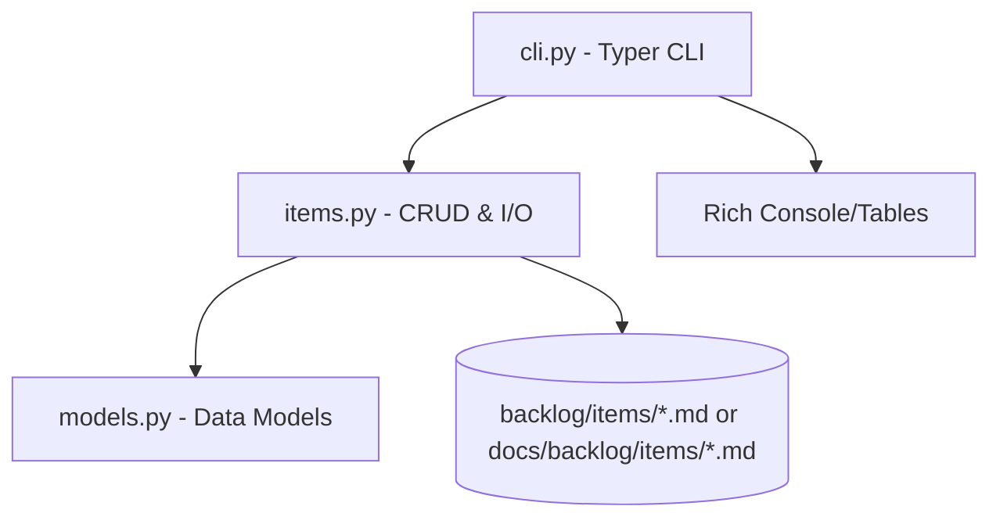

# ARCHITECTURE.md — Backlog CLI 架构文档

## 架构概览

三层结构，上层依赖下层：



## 核心技术栈

| 层 | 组件 | 选型 | 理由 |
|----|------|------|------|
| CLI | Typer | 0.15+ | Click-based，Python 3.12+ type hint 友好 |
| 输出 | Rich | 13.0+ | 终端表格/颜色，开发体验好 |
| 模型 | Pydantic | 2.10+ | 数据验证 + 序列化，枚举类型安全 |
| 序列化 | python-frontmatter | 1.1+ | YAML frontmatter + Markdown body 读写 |
| 构建 | hatchling | PEP 621 | 轻量，零配置 |

## Portable Backlog Store

`backlog/Store@1` 以一个准确的绝对 store root 为 authority，不依赖 Workspace Control、Project Ops、
固定用户路径或目录名推导。其静态结构为：

```text
backlog/
├── backlog.json
├── items/
├── INDEX.md
└── .lock                 # 可选；仅在写入期间创建
```

`backlog.json` 是严格 schema，且只能包含以下字段：

```json
{
  "schema": "backlog/Store@1",
  "project_id": "backlog-cli",
  "id_prefix": "BAC"
}
```

- `schema` 必须精确为 `backlog/Store@1`。
- `project_id` 必须以字母或数字开始，之后只能使用字母、数字、`-`、`_`。
- `id_prefix` 必须以大写字母开始，之后只能使用大写字母、数字、`_`。
- `backlog.json`、`items/` 和 `INDEX.md` 均为必需的直接 entry，分别必须是普通文件、目录和普通文件；
  已存在的 `.lock` 也必须是普通文件。loader 不创建任何 entry。

`store.load_store(root)` 返回不可变的 `StoreContext`，统一持有 canonical root、manifest、manifest path、
items path、index path 和 lock path。它仅接受绝对 root，并拒绝缺失、非规则 entry、静态 symlink 或
解析后逃逸 root 的路径。当前安全边界是受信任本机用户和受信任 store root：防御静态 containment escape
并支持正常并发；不承诺抵抗同一用户在校验后替换 ancestor 的攻击。

## 核心流程

### 数据存储

```
<target>/backlog/              # Project Ops target，存在时优先
<target>/docs/backlog/         # Repo target 默认路径
├── INDEX.md              # generate_index() 自动生成
└── items/
    ├── ZHI-001.md         # 每项一个文件
    ├── ZHI-002.md
    └── INK-001.md
```

每文件格式：

```
---
id: "ZHI-001"
project: "zhijian"
title: "..."
category: feature
priority: P1
status: todo
...
---

Markdown 正文（body）
```

### ID 生成流程

1. 默认取注册表 `projects.json` 里该项目的 `backlog_prefix`；如果未配置或为空，取 `project` 值前 3 个字母大写（如 `zhijian` → `ZHI`）。
2. 在并发文件锁 `_lock_backlog` 保护下执行 ID 分配。
3. **前缀智能兼容 fallback**：扫描当前项目下所有已有的条目 ID。若有且仅有一个前缀存在（如 `BAC`），即使注册表已被更新为其他前缀（如 `BCK`），也将自动沿用该已有前缀，以保证项目内 ID 的连续性。
4. 扫描该前缀在 `items/` 目录中的最大序号，返回 `<前缀>-<最大序号+1>`（三位补零，如 `BAC-023`）。

### 项目发现流程

- **显式传入 `project_path`（如指定 `--target` 参数）**：若 `project_path / backlog /` 已存在则优先使用；否则定位到 `project_path / docs / backlog /`。不会向上寻找。
- **未传入 `project_path`**：调用 `_find_backlog_dir(start)` 从当前工作目录（CWD）向上逐级查找 `docs/backlog/`，找到即返回；若查找到根目录依然没有，则在当前工作目录下创建 `docs/backlog/`。

### 推荐排序

```
score = priority_weight × impact_weight × effort_weight
```

done/cancelled 条目 score=0。`next` 只推荐 todo/in_progress；`list --sort score`
仍可显示 blocked 条目的 score。

## 模块接口

### models.py → items.py, cli.py

```python
# 枚举
class Priority(str, Enum): P0, P1, P2, P3
class Status(str, Enum): todo, in_progress, done, cancelled, blocked
class Effort(str, Enum): XS, S, M, L, XL
class Impact(str, Enum): high, medium, low
class Category(str, Enum): bug, a11y, ux, ..., ops

# 模型
class BacklogItem(BaseModel):
    id: str
    project: str
    title: str
    category: Category
    priority: Priority
    effort: Effort
    impact: Impact
    status: Status
    related_docs: list[str]
    revision: str  # 乐观锁版本指纹 (UUID hex 前8位)
    ...
    score: float  # @computed_field
```

### items.py → cli.py

```python
list_items(project_path: Path | None) -> list[BacklogItem]
show_item(item_id: str, project_path: Path | None) -> BacklogItem | None
add_item(item: BacklogItem, project_path: Path | None) -> Path
update_item(item_id: str, updates: dict, project_path: Path | None, expected_revision: str | None) -> BacklogItem | None
next_id(project_name: str, project_path: Path | None) -> str
generate_index(project_path: Path | None, project: str | None) -> str
```

## 关键设计决策

| 决策 | 选 A | 弃 B | 理由 |
|------|------|------|------|
| 存储方式 | 每个条目一个 .md 文件 | 单 JSON/YAML 文件 | 人类可读、git diff 友好、并发写入安全 |
| ID 方案 | 项目前3字母+序号 | UUID | 简短、人类可读、便于对话引用 |
| 全局 `--dir` | 单回调设置全局变量 | 每个子命令传参 | 简化子命令签名，单次调用只操作一个项目 |
