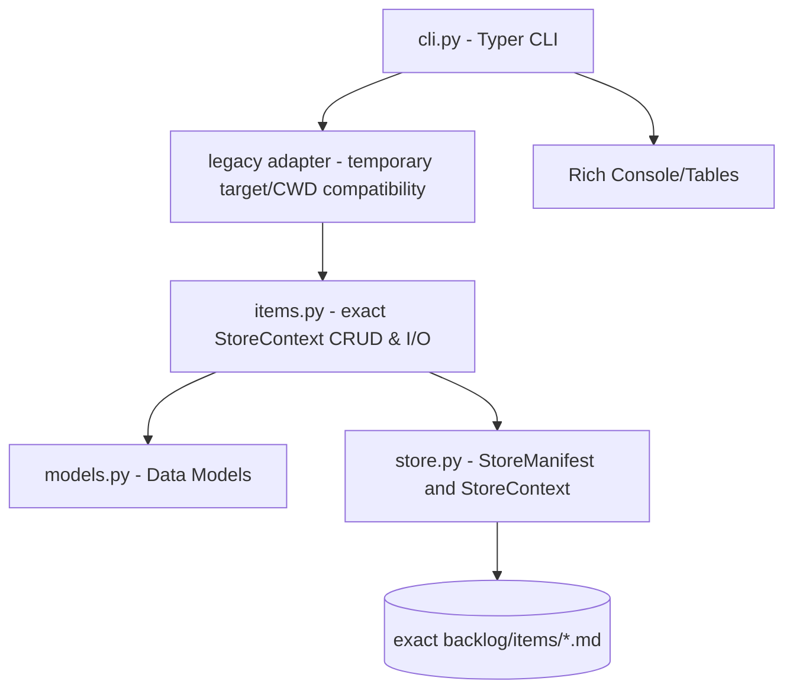

# ARCHITECTURE.md — Backlog CLI 架构文档

## 架构概览

三层结构，上层依赖下层：



## 核心技术栈

| 层 | 组件 | 选型 | 理由 |
|----|------|------|------|
| CLI | Typer | 0.15+ | Click-based，Python 3.12+ type hint 友好 |
| 输出 | Rich | 13.0+ | 终端表格/颜色，开发体验好 |
| 模型 | Pydantic | 2.10+ | 数据验证 + 序列化，枚举类型安全 |
| 序列化 | python-frontmatter | 1.1+ | YAML frontmatter + Markdown body 读写 |
| 构建 | hatchling | PEP 621 | 轻量，零配置 |

## Portable Backlog Store

`backlog/Store@1` 以一个准确的绝对 store root 为 authority，不依赖 Workspace Control、Project Ops、
固定用户路径或目录名推导。其静态结构为：

```text
backlog/
├── backlog.json
├── items/
├── INDEX.md
└── .lock                 # 可选；仅在写入期间创建
```

`backlog.json` 是严格 schema，且只能包含以下字段：

```json
{
  "schema": "backlog/Store@1",
  "project_id": "backlog-cli",
  "id_prefix": "BAC"
}
```

- `schema` 必须精确为 `backlog/Store@1`。
- `project_id` 必须以字母或数字开始，之后只能使用字母、数字、`-`、`_`。
- `id_prefix` 必须以大写字母开始，之后只能使用大写字母、数字、`_`。
- `backlog.json`、`items/` 和 `INDEX.md` 均为必需的直接 entry，分别必须是普通文件、目录和普通文件；
  已存在的 `.lock` 也必须是普通文件。loader 不创建任何 entry。

`store.load_store(root)` 返回不可变的 `StoreContext`，统一持有 canonical root、manifest、manifest path、
items path、index path 和 lock path。它仅接受绝对 root，并拒绝缺失、非规则 entry、静态 symlink 或
解析后逃逸 root 的路径。当前安全边界是受信任本机用户和受信任 store root：防御静态 containment escape
并支持正常并发；不承诺抵抗同一用户在校验后替换 ancestor 的攻击。

## 核心流程

### 数据存储

```
<exact-store>/
├── backlog.json
├── INDEX.md              # generate_index() 自动生成
└── items/
    ├── ZHI-001.md         # 每项一个文件
    ├── ZHI-002.md
    └── INK-001.md
```

每文件格式：

```
---
id: "ZHI-001"
project: "zhijian"
title: "..."
category: feature
priority: P1
status: todo
...
---

Markdown 正文（body）
```

### ID 生成流程

1. Core 只从 `StoreContext.manifest.id_prefix` 取得前缀。
2. 在 exact store 的 `.lock` 上取得排他锁后分配 ID。
3. 扫描该前缀在 exact `items/` 目录中的最大序号，返回 `<前缀>-<最大序号+1>`（三位补零，如 `BAC-023`）。
4. 创建和 patch 均验证 item 的 `project` 和 ID prefix 与 manifest 一致；验证失败、依赖失败和 revision conflict 不会写入 item 或 index。
5. mutation 取得 store lock 后重新载入同一 exact root 的 manifest；若 legacy adapter 先前构造的 context 已被不同 identity 的
   manifest 取代，mutation 会在任何写入前 fail closed。

### CLI Store 入口与 Legacy 项目发现流程

`backlog --store <absolute-exact-root> <command>` 是权威 CLI entrypoint。CLI callback 通过
`load_store()` 严格载入 manifest；它不会从 parent、child、Repo、Project Ops 或 CWD 推导 store。
`--store` 不能与 `--target` 同时使用，invalid store 或 option combination 在 JSON 调用中返回稳定的
`STORE_INVALID` 或 `INVALID_INPUT` error envelope 和非零退出码。

旧 `--target` / CWD 布局解析是临时 outer adapter：显式 target 优先 `<target>/backlog/`，否则使用
`<target>/docs/backlog/`；未传 target 时才向上发现 `docs/backlog/`。若 legacy root 已有 manifest，adapter
严格载入它；否则仅在 adapter 层以既有布局和持久 item identity 构造 temporary context。两条入口均调用同一
exact core。`items.py` 的 `add_item`、`update_item`、`next_id`、`generate_index` 与
`check_dependencies` 不接受 project path，也不执行 discovery。`patch_item` 在同一锁内比较
expected revision、验证依赖、识别 no-op，并仅在有实际变更时生成新 revision、写入 item 和重建 index；
`update_item` 保留为只返回条目的兼容 wrapper。

管理员可使用 `provision-store --project-id <id> --id-prefix <prefix>` 为由 `--target`/CWD 解析的 legacy
root 创建 manifest。该路径要求 root、`items/`、`INDEX.md` 均为 contained regular entries，验证每个 item 的
物理 ID、`project` 与 prefix，并使用 no-clobber publish 创建 `backlog.json`；不猜测 identity，也不覆盖
已有 manifest。最终 manifest 检查、完整 item 验证、publish 与 post-publish load 都在与 normal mutation
共享的 store lock 内执行。

### Agent JSON 与 work queue

`list` 与 `show` 的 JSON 条目同时保留声明 `status` 和派生 `effective_status`，并以 `blocked_by` 返回未完成或
缺失的依赖。`add` 与 `update` 的 JSON data 是 mutation receipt：`before`、`result`、`changed_fields`、
`revision`、`no_op` 和 store identity 均在一次调用中返回。revision conflict 使用稳定的
`REVISION_MISMATCH` error code；其他可预期输入错误使用 `INVALID_INPUT`，找不到条目使用
`ITEM_NOT_FOUND`。

`next --json` 是 Agent work queue：每条记录有 `queue_state`（`in_progress`、`ready` 或 `blocked`）与
`blocked_by`，队列按状态、priority、ID 确定性排序。队列只暴露 `score_hint` 作为兼容解释信息，不能当作
任务完成度或编排决定。未指定 `--status` 时返回全部三态；显式 `--status todo|in_progress|blocked` 按
effective status 过滤。非 JSON 的 `next` 和其他 human/admin commands 保持原有兼容表面。

### 推荐排序

```
score = priority_weight × impact_weight × effort_weight
```

done/cancelled 条目 score=0。非 JSON 的 `next` 只推荐 todo/in_progress；`list --sort score`
仍可显示 blocked 条目的 score。Agent JSON work queue 不以 score 排序。

## 模块接口

### models.py → items.py, cli.py

```python
# 枚举
class Priority(str, Enum): P0, P1, P2, P3
class Status(str, Enum): todo, in_progress, done, cancelled, blocked
class Effort(str, Enum): XS, S, M, L, XL
class Impact(str, Enum): high, medium, low
class Category(str, Enum): bug, a11y, ux, ..., ops

# 模型
class BacklogItem(BaseModel):
    id: str
    project: str
    title: str
    category: Category
    priority: Priority
    effort: Effort
    impact: Impact
    status: Status
    related_docs: list[str]
    revision: str  # 乐观锁版本指纹 (UUID hex 前8位)
    ...
    score: float  # @computed_field
```

### items.py → cli.py

```python
list_items(store: StoreContext) -> list[BacklogItem]
show_item(item_id: str, store: StoreContext) -> BacklogItem | None

# Temporary legacy adapter for existing CLI compatibility only.
list_legacy_items(project_path: Path | None) -> list[BacklogItem]
show_legacy_item(item_id: str, project_path: Path | None) -> BacklogItem | None
add_legacy_item(item: BacklogItem, project_path: Path | None) -> Path
update_legacy_item(item_id: str, updates: dict, project_path: Path | None, expected_revision: str | None) -> BacklogItem | None

# Exact portable core API.
add_item(item: BacklogItem, store: StoreContext) -> Path
update_item(item_id: str, updates: dict, store: StoreContext, expected_revision: str | None) -> BacklogItem | None
patch_item(item_id: str, updates: dict, store: StoreContext, expected_revision: str | None) -> PatchResult | None
next_id(store: StoreContext) -> str
generate_index(store: StoreContext) -> str
check_dependencies(item_id: str, depends_on: list[str], store: StoreContext) -> None
```

`list_items` 和 `show_item` 是 portable core read API：调用者必须先通过
`store.load_store()` 获得准确的 `StoreContext`，它们不会检查 CWD、项目路径或 legacy layout，也不会创建任何文件。
CLI 通过明确命名的 legacy adapter 保持既有 `<target>/backlog/`、`<target>/docs/backlog/` 和 CWD
discovery 行为；该 adapter 不属于 portable core。

## 关键设计决策

| 决策 | 选 A | 弃 B | 理由 |
|------|------|------|------|
| 存储方式 | 每个条目一个 .md 文件 | 单 JSON/YAML 文件 | 人类可读、git diff 友好、并发写入安全 |
| ID 方案 | 项目前3字母+序号 | UUID | 简短、人类可读、便于对话引用 |
| 全局 `--store` / `--target` | 单回调设置一次 entrypoint context | 每个子命令重复解析 | 简化子命令签名，单次调用只操作一个 store |
