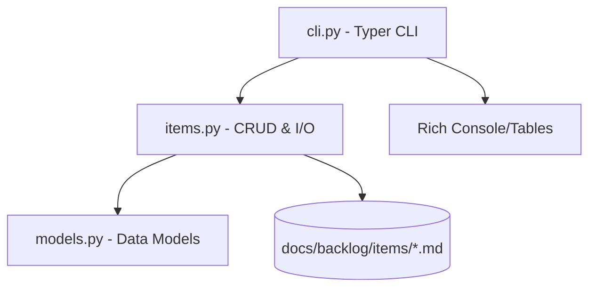

# ARCHITECTURE.md — Backlog CLI 架构文档

## 架构概览

三层结构，上层依赖下层：



## 核心技术栈

| 层 | 组件 | 选型 | 理由 |
|----|------|------|------|
| CLI | Typer | 0.15+ | Click-based，Python 3.12+ type hint 友好 |
| 输出 | Rich | 13.0+ | 终端表格/颜色，开发体验好 |
| 模型 | Pydantic | 2.10+ | 数据验证 + 序列化，枚举类型安全 |
| 序列化 | python-frontmatter | 1.1+ | YAML frontmatter + Markdown body 读写 |
| 构建 | hatchling | PEP 621 | 轻量，零配置 |

## 核心流程

### 数据存储

```
<project-root>/docs/backlog/
├── INDEX.md              # generate_index() 自动生成
└── items/
    ├── ZHI-001.md         # 每项一个文件
    ├── ZHI-002.md
    └── INK-001.md
```

每文件格式：

```
---
id: "ZHI-001"
project: "zhijian"
title: "..."
category: feature
priority: P1
status: todo
...
---

Markdown 正文（body）
```

### ID 生成流程

1. 取 `--project` 值的前 3 个字母，大写 → 前缀（如 `zhijian` → `ZHI`）
2. 扫描 `items/` 目录中同前缀的文件，取最大序号
3. 返回 `<前缀>-<最大序号+1>`（三位补零）

### 项目发现流程

`_find_backlog_dir(start)` 从指定目录向上逐级查找 `docs/backlog/`，找到即返回。未找到则在当前目录下创建。

### 推荐排序

```
score = priority_weight × impact_weight × effort_weight
```

done/cancelled 条目 score=0，自动排除。

## 模块接口

### models.py → items.py, cli.py

```python
# 枚举
class Priority(str, Enum): P0, P1, P2, P3
class Status(str, Enum): todo, in_progress, done, cancelled, blocked
class Effort(str, Enum): XS, S, M, L, XL
class Impact(str, Enum): high, medium, low
class Category(str, Enum): bug, a11y, ux, ..., ops

# 模型
class BacklogItem(BaseModel):
    id: str
    project: str
    title: str
    category: Category
    priority: Priority
    effort: Effort
    impact: Impact
    status: Status
    ...
    score: float  # @computed_field
```

### items.py → cli.py

```python
list_items(project_path: str) -> list[BacklogItem]
show_item(item_id: str, project_path: str) -> BacklogItem | None
add_item(item: BacklogItem, project_path: str) -> BacklogItem
update_item(item_id: str, updates: dict, project_path: str) -> BacklogItem
next_id(project_name: str, project_path: str) -> str
generate_index(project_path: str) -> None
```

## 关键设计决策

| 决策 | 选 A | 弃 B | 理由 |
|------|------|------|------|
| 存储方式 | 每个条目一个 .md 文件 | 单 JSON/YAML 文件 | 人类可读、git diff 友好、并发写入安全 |
| ID 方案 | 项目前3字母+序号 | UUID | 简短、人类可读、便于对话引用 |
| 全局 `--dir` | 单回调设置全局变量 | 每个子命令传参 | 简化子命令签名，单次调用只操作一个项目 |
