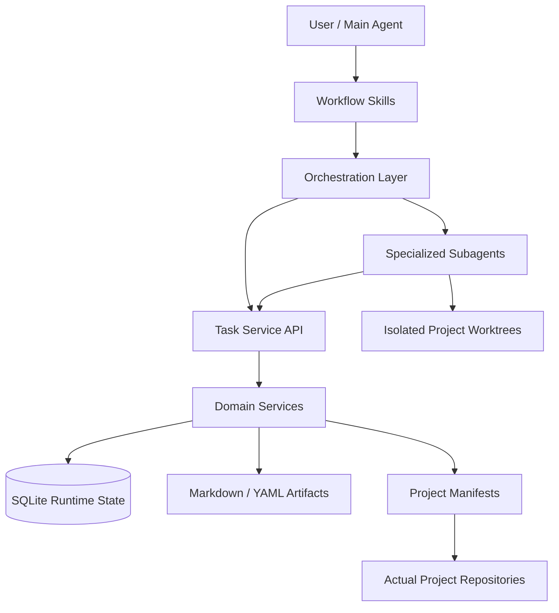

## 1. 定位与目标

### 1.1 文档定位

本文档记录项目未来的发展方向和总体构思，不是已经接受的架构决策，也不是可直接交给 executor
一次性实施的文件级执行计划。

后续开始落地前，应先根据本文档中的决策门创建 ADR，再把选定阶段拆分为独立执行计划和任务。

### 1.2 产品定位

项目应从“供人类和 Agent 调用的 Markdown backlog CLI”演进为独立的 **Agent Control Plane**：

- 集中管理多个项目的 Task、Run、Claim、Checkpoint、Submission 和 Review。
- 将 skills、subagent 定义、schemas 和 workflows 与服务实现放在同一 repo 中版本化。
- 通过 project manifest 与实际项目 repo 建立关系，但不取代项目自身的技术事实和约束。
- 通过 CLI、MCP 和 skills 暴露同一套领域服务。
- 支持 Agent 并发执行、上下文恢复、结构化交接、独立验收和完整审计。

### 1.3 核心原则

1. **Task 描述工作意图，Run 记录单次执行尝试。**
2. **Claim 负责并发控制，不能依赖 Agent 自觉修改状态。**
3. **Checkpoint 必须足以支持另一个 Agent 恢复工作。**
4. **Submission 只声明完成候选，Review 决定是否接受。**
5. **Skill 负责确定性流程，Subagent 负责有边界的专业判断，Service 负责事实与状态。**
6. **控制仓库拥有工作系统，实际项目 repo 拥有代码、项目约束和长期技术文档。**
7. **运行时协调状态不进入项目 repo，不因心跳、领取和失败尝试污染项目 git 工作区。**
8. **所有状态迁移由服务端校验，prompt 约束不能代替领域规则。**

### 1.4 非目标

- 不构建通用项目管理 SaaS。
- 不取代 Git、GitHub、项目 `AGENTS.md` 或项目架构文档。
- 不要求所有工作都经过重型多 Agent 流程。
- 不把任意自然语言 Agent 输出直接视为可信状态变更。
- 不在初期实现跨机器分布式调度。

## 2. 总体架构构思

### 2.1 系统边界



### 2.2 推荐仓库结构

长期目标是将当前 repo 演进或迁移为自包含控制仓库：

```text
agent-control-plane/
├── AGENTS.md
├── README.md
├── pyproject.toml
├── src/control_plane/
│   ├── domain/
│   ├── services/
│   ├── storage/
│   ├── scheduler/
│   ├── cli/
│   └── mcp/
├── schemas/
│   ├── task-v1.json
│   ├── work-package-v1.json
│   ├── checkpoint-v1.json
│   ├── submission-v1.json
│   └── review-v1.json
├── skills/
├── agents/
├── workflows/
├── projects/
├── tasks/
├── artifacts/
└── migrations/
```

运行时状态放在 repo 外：

```text
~/.local/state/agent-control-plane/
├── control-plane.sqlite
├── logs/
├── runs/
└── worktrees/
```

### 2.3 控制仓库与项目 repo 的职责

| 控制仓库负责 | 实际项目 repo 负责 |
|---|---|
| Task 定义与关系图 | 源代码 |
| Run、Claim、Checkpoint、Submission、Review | 项目 `AGENTS.md` |
| skills、subagents、schemas、workflows | 架构、产品和开发约束 |
| project manifests | 项目验证命令的实现 |
| 调度、恢复和审计历史 | 应长期保留的 ADR、research 和 plan |

控制仓库可以引用项目内 artifact，但不复制项目技术文档形成第二真相源。

### 2.4 Project Manifest

`projects/` 保存可提交的声明式 manifest，不直接保存指向项目 repo 的 symlink：

```yaml
schema_version: 1
id: backlog-cli
display_name: Backlog CLI

repository:
  remote: git@github.com:example/backlog-cli.git
  default_branch: main

context:
  instructions: AGENTS.md
  architecture: docs/ARCHITECTURE.md

verification:
  commands:
    - uv run pytest
    - uv run ruff check .
    - uv run pyright

execution:
  allow_parallel_runs: true

permissions:
  allowed_paths: [src/, tests/, docs/]
  denied_paths: [.env, secrets/]
```

本机路径使用不提交的配置映射：

```text
~/.config/agent-control-plane/projects.yaml
```

manifest、目标项目 `AGENTS.md` 和系统规则的优先级必须明确：

```text
系统安全规则
> 目标项目 AGENTS.md
> project manifest
> workflow 默认值
> subagent 自主判断
```

## 3. 领域模型与生命周期

### 3.1 核心对象

| 对象 | 职责 | 是否长期保留 |
|---|---|---|
| `Task` | 稳定的工作目标、范围、约束和验收标准 | 是 |
| `Run` | 一次执行尝试及其基线和结果 | 是 |
| `Claim` | 原子领取、owner、lease 和 revision | 运行期 |
| `Checkpoint` | 可恢复进度、发现、阻塞和下一步 | 是 |
| `Artifact` | research、ADR、plan、handoff 等成果引用 | 是 |
| `Submission` | 执行 Agent 提交的完成候选及证据 | 是 |
| `Review` | 独立验收结论和退回要求 | 是 |
| `Event` | append-only 状态变更审计记录 | 是 |

### 3.2 Task 契约

Task 不应继续只依赖标题、枚举字段和自由正文。建议至少包含：

```yaml
id: 01J...
alias: BAC-023
project: backlog-cli
title: 实现 task claim
objective: 支持 Agent 原子领取任务

scope:
  include: [src/backlog/claims.py]
  exclude: [MCP adapter]

constraints:
  - filesystem only
  - Python 3.12+

acceptance_criteria:
  - id: AC-1
    description: 两个 Agent 无法同时领取同一任务
    verification: uv run pytest tests/test_claims.py

relations:
  parent: null
  depends_on: []
  blocks: []
  discovered_from: null

status: ready
revision: 4
```

内部主键建议使用 ULID，当前 `BAC-023` 形式保留为人类可读 alias。这样可以在不扫描全局序号的情况下并发创建任务。

### 3.3 状态机

```text
draft
  ↓ refine
ready
  ↓ acquire
claimed
  ↓ start
executing
  ├─ checkpoint → executing
  ├─ wait → waiting
  ├─ handoff → ready
  ├─ fail → failed
  └─ submit → review
                 ├─ approve → accepted
                 └─ request_changes → ready

任何允许的阶段 → cancelled
```

约束：

- `blocked` 是根据依赖和外部条件计算的有效状态，不作为持久化生命周期状态。
- Claim 到期后释放任务，但保留原 Run 和最后 Checkpoint。
- Executor 无权直接将 Task 转为 `accepted`。
- `accepted` 必须来自 Review 或显式人工批准。

### 3.4 Work Package

Orchestrator spawn subagent 时，应传递标准 Work Package，而不是仅拼接自由文本 prompt：

```yaml
work_package_version: 1
task:
  id: 01J...
  revision: 4
run:
  id: run_01J...
role: executor
objective: ...
scope: ...
constraints: ...
acceptance_criteria: ...
project_context:
  root: /path/to/worktree
  instructions: AGENTS.md
  baseline_commit: abc123
allowed_actions:
  modify_files: true
  transition_task: false
  spawn_subagents: false
expected_output_schema: submission-v1
```

## 4. Skills、Subagents 与工作流

### 4.1 职责边界

| 组件 | 应负责 | 不应负责 |
|---|---|---|
| Skill | 触发条件、工具调用顺序、错误处理、状态迁移策略 | 大量自由分析、直接持有事实状态 |
| Subagent | 有边界的调研、规划、执行、验证或审查 | 自行领取其他任务、绕过状态机 |
| Orchestrator | 调度、重试、退出条件、工作包传递 | 直接修改代码、替代专业 reviewer |
| Task Service | 事实源、校验、并发、revision、事件 | 决定技术方案 |

### 4.2 基础操作 Skills

| Skill | 职责 |
|---|---|
| `task-intake` | 将用户请求整理为 Task 草案 |
| `task-refine` | 补全 scope、constraints 和 acceptance criteria |
| `task-query` | 查询 ready、waiting、review 等队列 |
| `task-acquire` | 原子领取并建立 Run 与 Claim |
| `task-checkpoint` | 保存可恢复进度 |
| `task-handoff` | 生成交接包并释放 Claim |
| `task-submit` | 汇总结果、证据和风险后提交 review |
| `task-review` | 记录独立验收结论 |
| `task-recover` | 恢复过期、失败或中断 Run |

这些 skills 应保持薄层，只通过稳定 API 操作领域对象。

### 4.3 工作流 Skills

| Skill | 场景 |
|---|---|
| `sprint-runner` | 单个中小型任务快速执行 |
| `project-orchestrator` | 多任务、多阶段、依赖图驱动实施 |
| `research-workflow` | 调研并产生 Task、artifact 或 ADR 候选 |
| `bug-workflow` | 复现、修复、回归验证 |
| `incident-workflow` | 紧急处理、恢复和事后记录 |
| `maintenance-runner` | 低风险、可自动验证的维护任务 |

现有 `sprint-runner` 和 `orchestrator` 可逐步迁移，但不应继续通过直接修改 Markdown body 或
`update --fixed` 模拟 Run、失败和验收。

### 4.4 Specialized Subagents

| Subagent | 输入 | 输出 | 关键限制 |
|---|---|---|---|
| `task-analyst` | 原始需求 | Task 草案 | 不修改代码 |
| `researcher` | 调研问题 | Findings artifact | 不决定最终方案 |
| `architect` | Task + findings | ADR / design artifact | 不执行实现 |
| `execution-planner` | Task + ADR | Execution plan | 不修改代码 |
| `executor` | Work Package | Submission candidate | 不接受任务 |
| `test-verifier` | 验收标准 + diff | Verification evidence | 不修代码 |
| `code-reviewer` | Submission + baseline | Review verdict | 不修改被审代码 |
| `recovery-agent` | Checkpoint + workspace | Recovery recommendation | 不自动覆盖现场 |

建议权限矩阵：

| 角色 | 修改代码 | 写 Checkpoint | 提交 Submission | 写 Review | 接受 Task |
|---|---:|---:|---:|---:|---:|
| Orchestrator | 否 | 否 | 否 | 否 | 否 |
| Executor | 是 | 是 | 是 | 否 | 否 |
| Verifier | 否 | 否 | 补充证据 | 否 | 否 |
| Reviewer | 否 | 否 | 否 | 是 | 经服务校验 |

### 4.5 标准工作流

单任务 Sprint：

```text
task_query
→ task_acquire
→ 创建隔离 worktree 与 Run baseline
→ executor
→ task_checkpoint
→ test-verifier
→ task_submit
→ code-reviewer
→ task_review
→ accepted 或 request_changes
```

大型需求：

```text
task-intake
→ task-analyst
→ researcher / architect
→ 父子 Task 与依赖图
→ execution-planner
→ orchestrator 调度 ready Tasks
→ 多个 executor 隔离执行
→ 独立 review
→ integration review
→ 父 Task accepted
```

中断恢复：

```text
Claim 到期
→ task-recover 查询过期 Run
→ recovery-agent 读取 Checkpoint 与 worktree
→ 新 Agent acquire
→ 从 Checkpoint 继续、交接或放弃原 Run
```

## 5. API、存储与执行隔离

### 5.1 MCP / CLI 领域动作

MCP 和 CLI 应映射领域动作，而不是直接暴露通用 CRUD：

```text
task_create
task_refine
task_get
task_query
task_acquire
task_renew_claim
task_release
task_checkpoint
task_handoff
task_submit
task_review
task_cancel

run_get
run_list
run_recover

artifact_put
artifact_get

project_register
project_get_context
```

所有写操作应支持：

- `expected_revision`
- `idempotency_key`
- `actor`
- `reason`

### 5.2 存储分层

| 存储 | 用途 |
|---|---|
| SQLite | Task/Run 状态、Claim、lease、revision、事件、调度查询 |
| Markdown / YAML | 人类可审查的 Task 投影和长期 artifacts |
| Project repo | 代码与项目长期技术文档 |
| Local state directory | logs、worktrees 和运行时临时文件 |

建议采用：

```text
SQLite = 操作事实源
Markdown = 可读投影与长期 artifact
```

SQLite 需要 migration、备份、导入导出和 append-only event audit。Markdown 投影不应反向覆盖
SQLite 事实，除非通过显式 import 流程和冲突检查。

### 5.3 Worktree 隔离

每个 Run 默认在独立 git worktree 中执行：

```text
task_acquire
→ 创建 Run
→ 创建目标项目独立 worktree
→ executor 修改和验证
→ reviewer 检查
→ 生成 commit / PR 或交还用户
→ 清理 worktree
```

这将取代当前依赖共享工作区和 `git status` baseline 区分 Agent 改动的主要机制。

### 5.4 自我修改

控制系统修改自身时必须使用特殊规则：

- 在独立 worktree 中执行。
- 当前 Run 固定使用启动时版本的 skills、schemas 和 workflows。
- 新版本通过 review 后才激活。
- 禁止运行过程中热替换当前 workflow。
- 激活失败时保留旧版本入口。

## 6. 演进路线

### Phase 0：冻结方向并完成决策

目标：把本文档中的候选方向转化为明确 ADR。

需决定：

- 当前 repo 原地演进，还是新建 `agent-control-plane` repo 后迁移。
- SQLite 是否作为操作事实源。
- Task 是否全部集中存储。
- project manifest 与本机路径映射格式。
- 首期是否要求独立 worktree。
- 首期 Agent 平台和 subagent adapter 范围。

退出条件：

- Agent Task Lifecycle ADR accepted。
- Control Plane Repository Boundary ADR accepted。
- Storage and Projection ADR accepted。

### Phase 1：生命周期核心

目标：先验证领域模型，不实现完整 MCP 和自动调度。

范围：

- 实现 Task、Run、Claim、Checkpoint、Submission、Review、Event。
- 实现严格状态机、revision 和原子 `task_acquire`。
- 提供最小 CLI 验证完整生命周期。
- 增加 schema contract tests 和并发领取测试。

退出条件：

- 两个进程不能同时领取同一任务。
- 中断 Run 可以从 Checkpoint 被另一个 Agent 理解和恢复。
- Executor 无法绕过 Review 将 Task 标记为 accepted。

### Phase 2：项目注册与执行隔离

目标：可靠连接实际项目 repo。

范围：

- project manifest 与本机路径映射。
- 读取并强制目标项目 `AGENTS.md`。
- 为每个 Run 创建、追踪和清理独立 worktree。
- 执行项目验证命令并记录 evidence。

退出条件：

- 两个 Run 可在同一项目的独立 worktree 中并行执行。
- 运行时状态不会污染目标项目默认工作区。

### Phase 3：Skills 与 Subagents 迁移

目标：使用新生命周期重写现有工作流。

范围：

- 实现基础操作 skills。
- 改造 `sprint-runner` 和 `orchestrator`。
- 定义 Work Package、Checkpoint、Submission、Review schemas。
- 建立 executor、verifier、reviewer、recovery-agent 权限边界。

退出条件：

- 标准 Sprint 不再直接调用 `update --fixed`。
- 失败和中断不会覆写 Task 定义。
- Review 与执行上下文相互独立。

### Phase 4：MCP 与多 Agent 调度

目标：提供 Agent 原生入口并支持受控并行。

范围：

- MCP adapter 直接调用 domain service。
- ready queue、lease heartbeat、过期 Claim 回收。
- 父子 Task、依赖图和 integration review。
- 幂等写入和结构化错误契约。

退出条件：

- MCP 完成从 acquire 到 review 的完整闭环。
- 多 Agent 并发执行不会发生重复领取或运行时状态覆盖。

### Phase 5：迁移、兼容与运维

目标：将 Backlog CLI 用户平滑迁移到新系统。

范围：

- 导入现有 `docs/backlog/items/*.md`。
- 保留只读或兼容 CLI。
- 提供 Task/Artifact export、import、backup 和 recovery。
- 建立系统自我升级与回滚流程。

退出条件：

- 现有 backlog 条目可无损迁移或明确报告不兼容字段。
- 控制平面状态可备份、恢复和审计。

## 7. 关键决策门

以下问题在对应 ADR 被接受前，不应固化到实现：

| 决策 | 推荐方向 | 主要代价 |
|---|---|---|
| Repo 边界 | 独立 Agent Control Plane repo | 需要迁移现有 Backlog CLI |
| 事实源 | SQLite + Markdown 投影 | 不再是纯文件系统工具 |
| Task 位置 | 集中于控制平面 | 项目 repo 不再天然携带完整待办 |
| 项目挂钩 | manifest + 本机路径映射 | 需要配置同步和校验 |
| 执行隔离 | 每 Run 独立 worktree | 增加生命周期管理成本 |
| Agent 接口 | 领域动作型 MCP | 需要维护 schemas 和 adapter |
| 内部 ID | ULID，保留人类 alias | 迁移和展示逻辑更复杂 |
| 验收权限 | Executor 与 Reviewer 分离 | 小任务流程成本增加 |

## 8. 风险与缓解

| 风险 | 影响 | 缓解方向 |
|---|---|---|
| 系统复杂度超过实际收益 | 维护成本上升 | 先做生命周期最小闭环，延后调度器 |
| 控制平面成为单点故障 | 全部任务不可用 | 备份、event log、export/import |
| 控制仓库与项目约束冲突 | Agent 执行错误 | 明确优先级并强制读取项目 AGENTS.md |
| Task 与项目 artifact 双重真相 | 文档漂移 | Task 只引用项目 artifact，不复制正文 |
| SQLite 与 Markdown 投影漂移 | 展示不可信 | 单向投影、显式 import、revision 校验 |
| Worktree 泄漏或未清理 | 磁盘和分支混乱 | Run 生命周期管理和垃圾回收命令 |
| Review 流程对小任务过重 | Agent 效率下降 | 提供人工批准和风险分级 workflow |
| 系统自我修改导致运行中断 | 控制平面不可用 | 固定运行版本、延迟激活、可回滚 |

## 9. 首个验证切片

在做完整平台前，建议实施一个最小可证伪切片：

```text
单项目
+ 单机
+ SQLite
+ Task / Run / Claim / Checkpoint / Submission / Review
+ CLI
+ 一个 sprint-runner skill
+ executor 与 reviewer 两个角色
+ 每 Run 独立 worktree
- MCP
- 自动并行调度
- 跨机器协调
```

验证问题：

1. Task 与 Run 分离是否真正改善失败重试和历史可读性？
2. Checkpoint 是否足以让新 Agent 在不了解原会话的情况下恢复？
3. Claim + lease 是否解决重复执行，而没有引入过高运维成本？
4. 独立 worktree 是否显著降低脏工作区和并行执行复杂度？
5. Executor / Reviewer 分离是否能提高验收可信度？
6. skills 与 service 同 repo 版本化是否能减少契约漂移？

若该切片无法证明价值，应停止扩展 MCP、调度器和多项目能力。

## 10. 后续产物

正式开始演进时，按以下顺序创建文档和实施任务：

1. `docs/adr/NNN-agent-task-lifecycle.md`
2. `docs/adr/NNN-control-plane-repository-boundary.md`
3. `docs/adr/NNN-runtime-storage-and-projections.md`
4. 最小验证切片的文件级执行计划
5. 对应 backlog / Task 条目

本文档应在以下情况更新：

- 上述 ADR 接受、拒绝或改变关键方向。
- 最小验证切片得出结论。
- repo 边界、领域模型、存储策略或工作流职责发生变化。

## 11. 最终状态

- **当前结论**：方向构思已记录，尚未形成 accepted ADR。
- **当前实现**：Backlog CLI 仍按现有架构运行。
- **下一决策点**：是否进入 Phase 0，起草并评审三个基础 ADR。
- **代码变更**：无。

## 12. 决策记录

### 2026-06-08: 另起炉灶，定名 Sigil

**决策**：
1. 不在 backlog-cli 基础上演进。新建独立 repo `sigil`（`~/ai/sigil/`），作为独立的 Agent Contract Platform。
2. backlog-cli 保留为轻量 Markdown 任务管理工具，维护模式，不引入 SQLite/状态机/worktree。
3. 哲学断层：backlog-cli 事实源是 Markdown 文件；Sigil 事实源是 SQLite + schema-validated artifacts。两者交集仅限于一次性导入。

**理由**：
- 两个项目是不同的物种，强行融合会互相污染。
- Sigil 从 Day 1 就以契约和 artifact 为核心，不需要背负旧模型的历史包袱。

**三层递进架构**：
```
Layer 0: Schemas only — 任何 agent skill 可直接消费 JSON Schema
Layer 1: +Services — SQLite 状态机、Claim 原子性、CLI/MCP
Layer 2: +Worktree + Scheduler — 隔离、并发、依赖图
```

多数场景 Layer 0 已足够：orchestrator skill 读 work-package-v1 schema，构造 WorkPackage 文件，spawn executor subagent 时让它消费。

**Phase 0 产出**（已完成初始交付）：
- 6 个 JSON Schema：artifact-v1, task-v1, work-package-v1, checkpoint-v1, submission-v1, review-v1
- Python 参考实现：Pydantic models（frozen, YAML 可往返）
- 跨字段业务规则校验器

**待决策**：
- 并行调度从 Phase 4 降级为 Layer 2 的可选优化，不再是核心架构关注点。
- 契约和 artifact 提升为系统设计的一等关注点。
